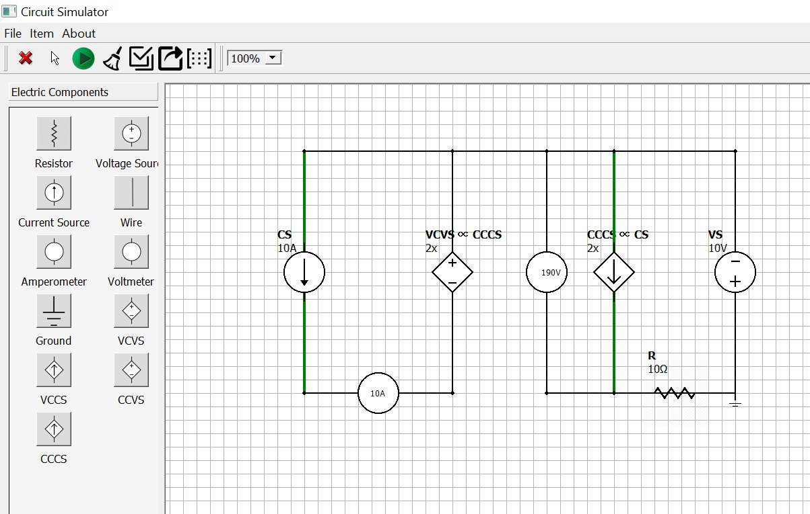
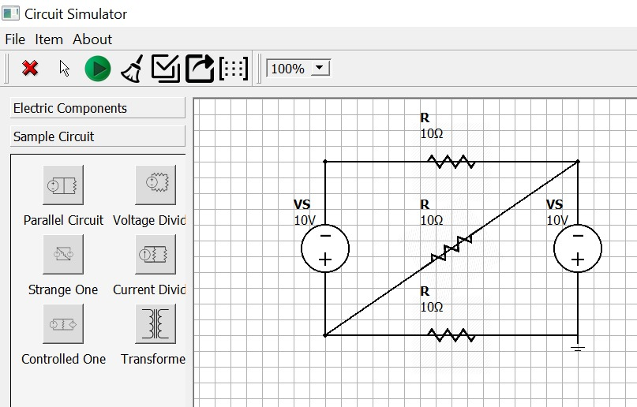

## CIRCUIT SIMULATOR
Circuit Simulator is a desktop app, developed in C++ and Qt, that permits the user to design 
its own electrical circuit and find the voltages and currents involved. This project was developed for the exam of Programming during the first year of the Bachelor degree.

### Main features
<ol>
    <li><strong>Design Flexibility:</strong> Create your unique electrical circuits by utilizing a diverse range of components available within the application.</li>
    <li><strong>Predefined Circuits:</strong> Explore and modify a collection of predefined circuits to understand various configurations and experiment with different setups.</li>
    <li><strong>Real-time Analysis:</strong> Instantly check currents and voltages along the components of your circuit, aiding in a comprehensive understanding of your design.</li>
    <li><strong>Intuitive User Interface:</strong> The user-friendly interface offers a seamless experience with drag-and-drop functionality for effortless circuit creation.</li>
    <li><strong>Save and Load:</strong> Save your meticulously designed circuits for future reference or load previously saved circuits to pick up right where you left off.</li>
</ol>


### UI
#### Electrical components view
<div align="center">
    
</div>
<br />

#### Predefined circuits view
<div align="center">
    
</div>

### Testing environment
The application was run on a Windows 11 environment, using MINGW 8.1, Qt 5.15.2 and Eigen 3.3.9

### How to run
Firstly, you need to move into project folder and then in <i>sources</i> via console. Then prompt this command: 
```
qmake -project
```
This will create the .pro file, which we need to modify, as shown below, in order to include all the libraries. 
```
RESOURCES += components.qrc                                           
QT += widgets                                                        
INCLUDEPATH += C:\Users\ciuff\Desktop\eigen-3.3.9                       
CONFIG += c++11  
```
Then, you need to launch the commands below in order to compile the makefile.
```
qmake
mingw32-make
```
Last thing to do is to copy dll files from `qt/bin` and `qt/plugins/platform` into project's `release` folder, where `qt` refers to the local installation path for Qt.
